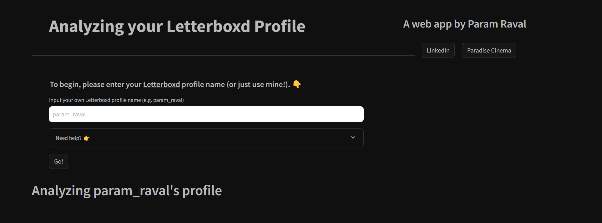
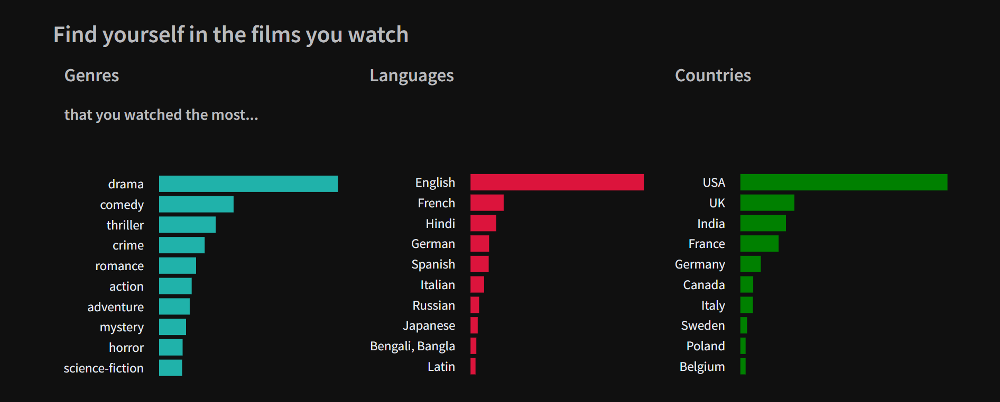
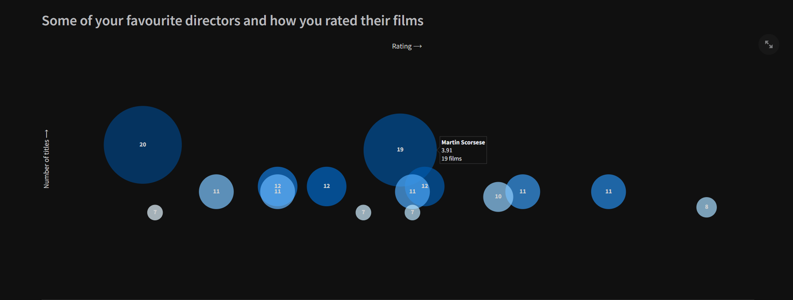

# Letterboxd Stats

A web-app to get pretty charts that show your taste in films! The app uses public data from your Letterboxd profile and creates visuals that can usually be seen only by the Letterboxd Pro users!

Developed using Python, Plotly and Streamlit.

**Note: the code is still pretty messy (to be fixed soon).**
# Setup

## Installation

Use Python 3.9.10 or newer and install the requirements.

`pip install -r requirements.txt`
## Run this app

Run the `app.py` from the primary directory

`streamlit app.py`

### Follow the instructions on the screen...

### and see customised visuals showing...

### different genres and languages that you watch...

### the directors you love...

### and more.

Notes:
- Be patient if your profile has thousands of films logged and rated!
- This project is for educational purposes only. Support the Letterboxd Team and [find out more here](https://letterboxd.com/about/faq/).